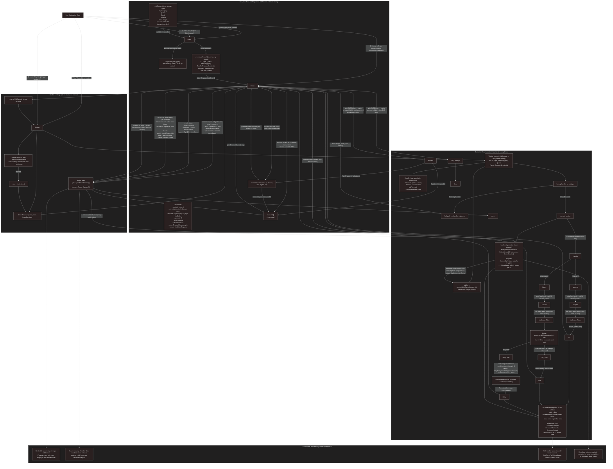

```mermaid
---
config:
  layout: dagre
  theme: neo-dark
---
flowchart TB
 subgraph ENQ["Enqueue flow: JobRequest -> JobRecord -> Driver storage"]
    direction TB
        JR["JobRequest (user-facing)<br>Type<br>Payload(any)<br>Queue<br>RunAt<br>Timeout<br>MaxAttempts<br>(+ future fields like idempotency key)"]
        C1["Client does:<br>- validate request<br>- normalize defaults (queue, etc.)<br>- encode Payload(any) -&gt; []byte via Codec<br>- generate ID<br>- set CreatedAt<br>- set Attempts=0<br>- copy Timeout/MaxAttempts<br>- persist via driver.Enqueue"]
        PAY["Payload bytes ([]byte)<br>(encoded by codec, JSON by default)"]
        JREC["driver.JobRecord (driver-facing, stored)<br>ID, Type, Queue<br>Payload([]byte)<br>RunAt, Timeout, CreatedAt<br>Attempts, MaxAttempts<br>LastError, FailedAt"]
        C["Client"]
        D["Driver"]
        RUNQ["runnable[]<br>(ready now)"]
        SCHQ["scheduled (min-heap by RunAt)<br>(not eligible yet)"]
  end
 subgraph LOOP["Worker run loop: poll -> reserve -> execute"]
    direction TB
        WLOOP["Worker.Run(ctx) loop<br>- obeys ctx cancellation<br>- concurrency-limited with sem + waitgroup"]
        W["Worker"]
        NOW["now = clock.Now()"]
        RES["driver.Reserve(queue, now, leaseDuration)"]
        INFL["inflight map<br>(id -&gt; {JobRecord, Lease})<br><br>Lease = {Token, ExpiresAt}"]
        RET["returns (JobRecord, Lease, ok=true)"]
  end
 subgraph EXEC["Execution flow: handler + heartbeat + completion"]
    direction TB
        CONV["Worker converts JobRecord -&gt; Job (handler-facing)<br>Job.ID, Type, Payload([]byte), Queue<br>RunAt, Timeout, CreatedAt"]
        CTX["jobCtx = context.WithCancel(parent ctx)<br>(cancelable per-job context)"]
        MW["Handler is wrapped with middleware:<br>- Recover (panic -&gt; error)<br>- Timeout (ctx cancel on job.Timeout)<br>- user middleware chain"]
        LOOKUP["lookup handler by job type"]
        NOH["Fail path: no handler registered"]
        HAS["execute handler"]
        HB["Heartbeat goroutine (lease renewal)<br>every HeartbeatInterval:<br>ExtendLease(id, token, now, leaseDuration)<br><br>Purpose:<br>- keep inflight lease alive for long jobs<br>- if ExtendLease fails -&gt; cancel jobCtx"]
        H["Handler"]
        OK["success"]
        ERR["failure"]
        STOPHB1["stop hb"]
        STOPHB2["stop hb"]
        TOK1["finalLease.Token"]
        TOK2["finalLease.Token"]
        VALIDNOTE@{ label: "All state-mutating calls MUST validate:<br>- job is inflight<br>- lease token matches current token<br>- lease is not expired at 'now'<br><br>If validation fails:<br>- ErrJobNotInflight / ErrLeaseMismatch / ErrLeaseExpired<br>- driver MUST NOT mutate state" }
        ACK["Ack"]
        DONE1["done"]
        DECIDE["decide: unrecoverable/maxAttempts -&gt; Fail<br>else -&gt; Retry (schedule next run)"]
        FAILP["DLQ path"]
        RETRYP["Retry path"]
        FAILCALL["Fail"]
        DLQ["DLQ storage"]
        DONE2["done"]
        BACKOFF["RetryUpdate {RunAt, Attempts, LastError, FailedAt}"]
        RETRYCALL["Retry"]
        REQUEUE["requeue"]
  end
 subgraph NOTES["Guarantees delivered by leases + heartbeat"]
    direction TB
        G1["No double processing during a valid lease<br>(Reserve must not return inflight job with active lease)"]
        G2["Crash recovery: if worker dies, heartbeat stops -> lease expires -> job becomes reservable again"]
        G3["Stale worker protection: old worker cannot Ack/Retry/Fail/ExtendLease without correct token"]
        G4["Heartbeat reduces duplicate execution for long-running jobs by extending lease expiry"]
  end
    U["User Application Code"] -- "1) choose a Driver implementation (memory/postgres/etc.)" --> D
    U -- 2) NewClient(driver, options) --> C
    U -- 3) NewWorker(driver, options) --> W
    U -- "4) worker.Register(jobType, handlerFn)" --> W
    U -- "5) client.Enqueue(ctx, JobRequest)" --> C
    JR -- validate + normalize --> C
    C -- encode payload via codec --> PAY
    C -- build JobRecord --> JREC
    JREC -- "driver.Enqueue(JobRecord)" --> D
    D -- "if RunAt is zero (or &lt;= now at reserve time)<br>store in runnable FIFO" --> RUNQ
    D -- if RunAt is in the future<br>store in scheduled heap --> SCHQ
    W --> WLOOP & RES & CONV
    WLOOP -- poll time --> NOW
    NOW --> RES
    RES --> D
    D -- "promote due scheduled jobs (RunAt &lt;= now)" --> SCHQ
    SCHQ -- move due jobs into runnable --> RUNQ
    D -- "reclaim expired inflight leases (crash recovery)<br>if lease.ExpiresAt &lt;= now:<br>- remove inflight entry<br>- job becomes runnable immediately" --> INFL
    INFL -- expired inflight jobs requeued as runnable --> RUNQ
    D -- pop 1 runnable job (if any) --> RUNQ
    D -- "create lease:<br>- Token (random)<br>- ExpiresAt = now + leaseDuration<br>store inflight[id] = {rec, lease}" --> INFL
    D --> RET
    RET --> W
    CONV --> CTX & MW & LOOKUP
    LOOKUP -- if missing handler --> NOH
    LOOKUP -- if handler exists --> HAS
    HAS --> HB
    HAS -- run wrapped handler(jobCtx, Job) --> H
    HB -- ExtendLease(id, token, now, leaseDuration) --> D
    D -- "VALIDATE (must pass):<br>- job is inflight<br>- token matches active lease token<br>- lease not expired at 'now'<br><br>If valid:<br>- update stored ExpiresAt = now + leaseDuration<br>- return updated Lease" --> INFL
    INFL -- return updated Lease (may rotate token) --> HB
    HB -- if ExtendLease returns error:<br>cancel jobCtx (stop work to reduce duplicate side effects) --> CTX
    NOH -- "driver.Fail(id, token, now, reason)" --> D
    H -- returns nil --> OK
    H -- returns error --> ERR
    OK -- stop heartbeat + wait hb goroutine exits --> STOPHB1
    ERR -- stop heartbeat + wait hb goroutine exits --> STOPHB2
    STOPHB1 -- use latest lease token (may have rotated) --> TOK1
    STOPHB2 -- use latest lease token (may have rotated) --> TOK2
    TOK1 -- Ack(id, token, now) --> ACK
    ACK --> D & VALIDNOTE
    D -- VALIDATE token + expiry<br>then remove inflight (terminal success) --> INFL
    INFL --> DONE1 & G1 & G2
    TOK2 --> DECIDE
    DECIDE -- unrecoverable OR attempts exhausted --> FAILP
    DECIDE -- retryable --> RETRYP
    FAILP -- Fail(id, token, now, reason) --> FAILCALL
    FAILCALL --> D & VALIDNOTE
    D -- VALIDATE token + expiry<br>remove inflight + store DLQ entry --> DLQ
    DLQ --> DONE2
    RETRYP -- "core computes next run:<br>nextAttempts = attempts+1<br>delay = retryPolicy.NextDelay(nextAttempts)<br>nextRunAt = now + delay" --> BACKOFF
    BACKOFF -- Retry(id, token, now, RetryUpdate) --> RETRYCALL
    RETRYCALL --> D & VALIDNOTE
    D -- VALIDATE token + expiry<br>remove inflight + update record<br>requeue by RunAt --> REQUEUE
    REQUEUE -- "RunAt==0 -> runnable" --> RUNQ
    REQUEUE -- "RunAt future -> scheduled" --> SCHQ
    HB --> VALIDNOTE & G4
    VALIDNOTE --> G3

    VALIDNOTE@{ shape: rect}
```
